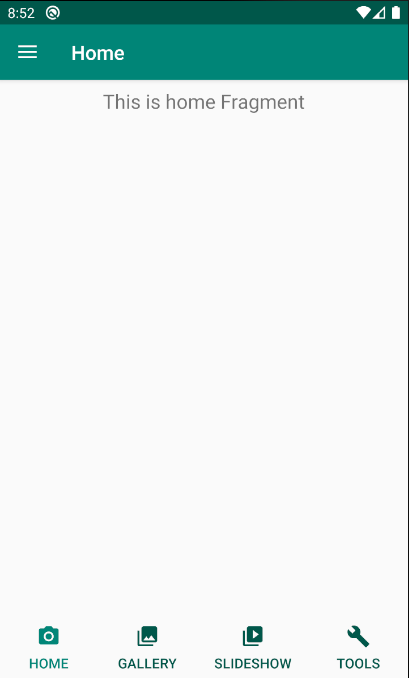
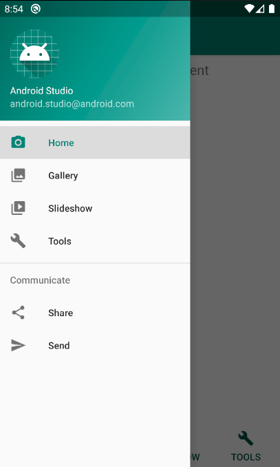
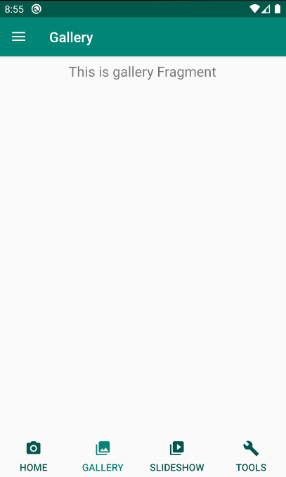

# DrawerLayout with simulated BottomNavigationView

This project is an example of how to use DrawerLayout and simulate BottomNavigationView using RadioButtons

## Screenshots






### Code that replaces BottomNavigationView

```xml
<RadioGroup
    xmlns:android="http://schemas.android.com/apk/res/android"
    xmlns:app="http://schemas.android.com/apk/res-auto"
    android:layout_width="match_parent"
    android:layout_height="wrap_content"
    android:orientation="horizontal"
    app:layout_constraintBottom_toBottomOf="parent">

    <RadioButton
        android:id="@+id/nav_home_button"
        android:checked="true"
        android:drawableTop="@drawable/selector_bottom_navigation_view_icon_home"
        android:text="@string/menu_home"
        style="@style/AppTheme.RadioButtonLikeBottomNavigationView">

    </RadioButton>

    <RadioButton
        android:id="@+id/nav_gallery_button"
        android:drawableTop="@drawable/selector_bottom_navigation_view_icon_gallery"
        android:text="@string/menu_gallery"
        style="@style/AppTheme.RadioButtonLikeBottomNavigationView">

    </RadioButton>

    <RadioButton
        android:id="@+id/nav_slideshow_button"
        android:drawableTop="@drawable/selector_bottom_navigation_view_icon_slideshow"
        android:text="@string/menu_slideshow"
        style="@style/AppTheme.RadioButtonLikeBottomNavigationView">

    </RadioButton>

    <RadioButton
        android:id="@+id/nav_tools_button"
        android:drawableTop="@drawable/selector_bottom_navigation_view_icon_tools"
        android:text="@string/menu_tools"
        style="@style/AppTheme.RadioButtonLikeBottomNavigationView">

    </RadioButton>

</RadioGroup>
```

### Code in the main activity

* Setup for BottomNavigation using RadioButton on click listener

```kotlin
private fun setupBottomNavigation() {
    nav_home_button.setOnClickListener {
        navigateTo(R.id.nav_home)
    }
    nav_gallery_button.setOnClickListener {
        navigateTo(R.id.nav_gallery)
    }
    nav_slideshow_button.setOnClickListener {
        navigateTo(R.id.nav_slideshow)
    }
    nav_tools_button.setOnClickListener {
        navigateTo(R.id.nav_tools)
    }
}
```

* Setup custom DrawerLayout listener

```kotlin
nav_view.setNavigationItemSelectedListener {
    when(it.itemId) {
        R.id.nav_home -> {
            nav_home_button.isChecked = true
            navigateTo(R.id.nav_home)
        }
        R.id.nav_gallery -> {
            nav_gallery_button.isChecked = true
            navigateTo(R.id.nav_gallery)
        }
        R.id.nav_slideshow -> {
            nav_slideshow_button.isChecked = true
            navigateTo(R.id.nav_slideshow)
        }
        R.id.nav_tools -> {
            nav_tools_button.isChecked = true
            navigateTo(R.id.nav_tools)
        }
    }
    drawer_layout.closeDrawer(GravityCompat.START)
    true
}
```